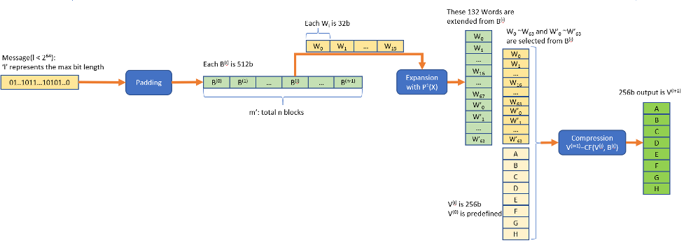
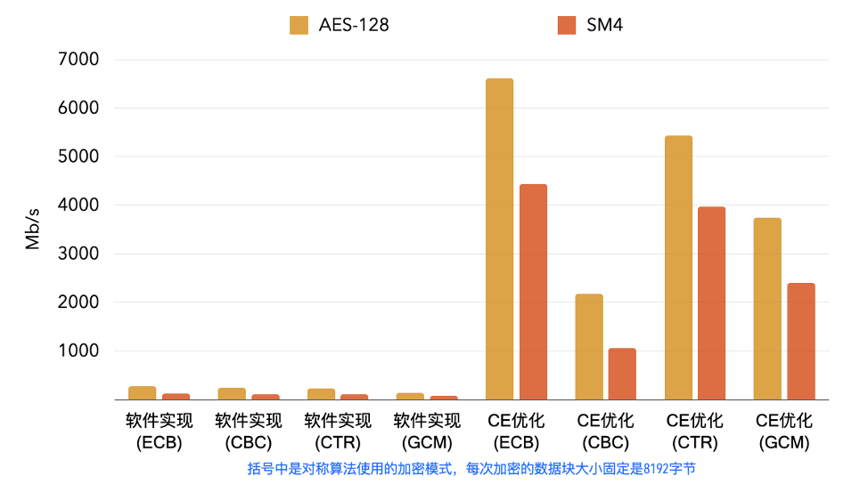

# 国密硬件加速与优化

性能是通用密码算法的一个重要工程指标，也是阻碍算法大规模应用的很重要一个衡量标准。

常用的密码算法经过验证后，算法本身是经久不变的，有着固定的输入输出，因此很容易作为固定的程序片断被固化到CPU或者外部集成电路上，固化到CPU上的往往表现为CPU
的扩展指令，比如x86上的AESNI指令，固化到外部集成电路上就成了支持算法加速的 PCIE 卡，比如QAT，CCP等。

算法的性能优化作为社区重点突破的方向，在x86和ARM架构上使用SIMD指令中实现了SM3和SM4算法性能的极大突破，

## 基于 CPU 指令集的国密算法优化

现代CPU中SIMD指令集是标准配置，各架构的SIMD指令也是大同小异，主流的密码算法，比如哈希算法和对称加密算法都是结构化的，因此使用 SIMD 来优化通用密码算法就是很自然的一个事情，事实上也有不错的优化效果。

可以认为AESNI是x86架构上专用用优化 AES 算法的SIMD指令，也常被用来间接优化其它算法，相比于通用的SIMD指令，专用指令能用更少的指令和时钟周期完成更多的操作，也会带来更大的性能提升。类似的，arm64架构上也提供了专用的 `Crypto Extension` 扩展，为主流的对称算法和哈希算法都提供了支持，也包括SM3和SM4算法。

本小节会以armv8架构为例来介绍国密算法的指令集优化。

### ARM 架构下国密算法的优化

为了提升国密算法的性能，Arm公司开发者基于Armv8.2中定义的`Cryptographic Extension`中的对国密SM3, SM4算法的硬件加速，实现了指令级的优化，获得了较好的性能提升。目前该优化在OpenSSL，libgcrypt和Linux内核中已经合入主线。

> 🟢 **SM3 在 Arm 架构上的优化实现**

SM3密码杂凑算法用来将一个长度为l（l < 2^64）的比特消息串进行填充和迭代压缩，生成256比特的杂凑值。SM3通常应用在数字签名和验证、消息认证码的生成与验证以及随机数的生成。具体算法参见[**SM3 密码杂凑算法规范**](https://www.oscca.gov.cn/sca/xxgk/2010-12/17/1002389/files/302a3ada057c4a73830536d03e683110.pdf)。SM3算法基本过程如下图：

其中的黑盒SM3算法如下图。其中扩展和压缩都是基于一个256b的B(i)块来描述相应的处理。

第一步是将输入消息按照一定规则末尾填充一些比特，使得总比特长度为512的倍数。

第二步是对填充后的消息按512b分块，对每个数据块B(i)按32b的字长分为16个字作为促使输入，依照P1(X)函数定义操作进行52次迭代扩展分别得到第16到67个字，然后使用0~67个字经过异或后生成最后的64个字的输出。

第三步是以每个B(i)块在第二步生成的128个字(去掉其中的64~67)  和 256b的向量V(i)作为输入进行64轮的迭代，生成一个新的 256b的V(i+1)作为下一次循环的输入向量。直到最后一个B块完成处理后得到的最后一个256b向量为SM3的最终hash 值。

##### Arm SM3指令

Arm SM3指令是Armv8.2引入的七条基于ASIMD的加密扩展指令，支持对SM3 hash算法的硬件加速。

消息扩展的处理由SM3PARTW1和SM3PARTW2配合完成，一次指令配对执行将并发完成4次P1(X)的处理而生成4个扩展字。对于一个B(i)块的扩展需要循环13次。

数据压缩 CF(V(i), B(i))需要64次循环完成，每次循环中的压缩处理由余下5条指令完成。

SM3SS1一次对3个字的数据完成压缩函数中的SS1运算，输出一个字作为后续其它压缩处理的输入。

SM3TT1A完成前16次循环所定义的TT1运算，而SM3TT1B完成后面48次循环所定义的TT1运算，输出的数据作为下一轮TT1运算的输入。每次执行完成对多个输入的字数据的并行处理。

SM3TT2A完成前16次循环中所定义的的TT2运算和准备下一轮TT2运算的输入数据，而SM3TT2B完成后面48次循环中定义的TT2运算。

可见SM3的压缩处理因为存在依赖而无法一次循环运算而完成多个256b的向量V(i)的输出。

##### SM3 优化效果

以下是在阿里云倚天710上的benchmark数据，SM3与SHA256哈希算法的软件实现（无优化）与Cryptographic Extension指令集优化后的性能对比：

##### SM3 优化总结

具体在OpenSSL中对SM3算法的优化参见[**OpenSSL SM3 优化实现**](https://github.com/openssl/openssl/blob/master/crypto/sm3/asm/sm3-armv8.pl)。从上面的描述可见，相关的指令都是借助了ASIMD中的128b vector寄存器，一次执行处理多个数据字，从而获得较好的并发度。其中压缩处理因为循环之间存在数据依赖，没法如同消息扩展的处理达到一次完成多个输出字的效果。

> 🟢 **SM4 在 Arm 架构上的优化实现**

SM4密码算法是一个分组算法。该算法的输入分组长度为128比特, 密钥长度为128比特。每次加解密都可以输出128比特。数据解密和数据加密的算法相同, 但解密轮密钥是加密轮密钥的逆序。

SM4算法主要分成两步，首先是每次密钥扩展会产生一个新的32b的轮密钥，迭代32次后会得到32个新的轮密钥用于后续的加解密处理。

对128b的分组数据进行加解密是使用上一步扩展出来的32个轮密钥rki进行32轮迭代，最后4轮迭代输出的4个字(128比特)就是密文或解压后的明文。下图是表示一次迭代的处理。

SM4算法中每次迭代的具体描述可以参看[**SM4分组加密算法规范**](http://www.gmbz.org.cn/upload/2018-04-04/1522788048733065051.pdf)。

##### Arm SM4指令

FEAT_SM4优化引入的两条可选加密扩展指令，同样是基于ASIMD技术来提升处理的并行度。其中指令`SM4EKEY`一次执行能扩展出来4个新的轮密钥，8次执行后就完成了所有32个轮密钥的生成。指令`SM4E`具有类似的并行度，每次执行能加解密出来4个字的数据，同样的8次执行后就能完成一个分组的加解密。

##### SM4 优化效果

以下是在阿里云倚天710上的benchmark数据，SM4与AES对称加密算法的软件实现（无优化）与Cryptographic Extension指令集优化后的性能对比：

##### SM4 优化总结

具体在OpenSSL中对SM4算法的优化补丁参见[**OpenSSL SM4优化实现**](https://github.com/openssl/openssl/blob/master/crypto/sm4/asm/sm4-armv8.pl)。基于上面的描述，优化的主要有：

* 借助SM4指令的SIMD属性一次执行完成多个字数据的处理。
* 每个SM4指令一次执行能并行完成4个期待的输出，减少了循环次数。
* 对于可以并行的分组加密模式，比如SM4-CTR, SM4-ECB等，可以对4个分组进行SM4计算，充分地利用流水线，让计算可以并行进行。

除此之外，Arm公司开发者还进一步提升了SM4-GCM的性能。考虑到FEAT-SM4是可选的架构特性，在某些SoC中不一定支持，Arm公司开发者基于Neon指令实现了Armv8下的SM4，从而在没有FEAT-SM4的设备上也能获得相当的提升。

从性能上来说SM4指令的使用可以大幅地提升性能。从安全性来说，硬件指令集成了S盒替换的功能，使得这部分计算变成了时间一致的操作，大大减小了侧信道攻击的可能性，保证了算法的安全。

## 国密加速器支持

* Intel QAT
* Hygon CCP
* YCC

{{#template ../template/footer.md}}
