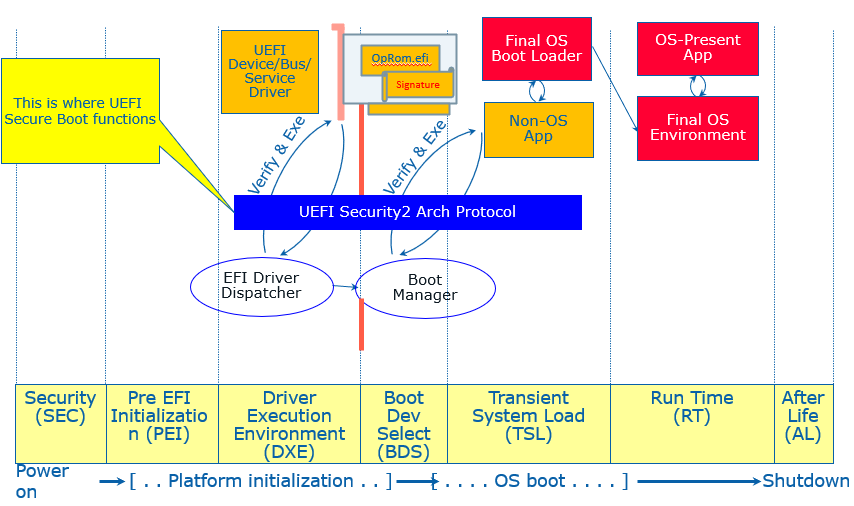
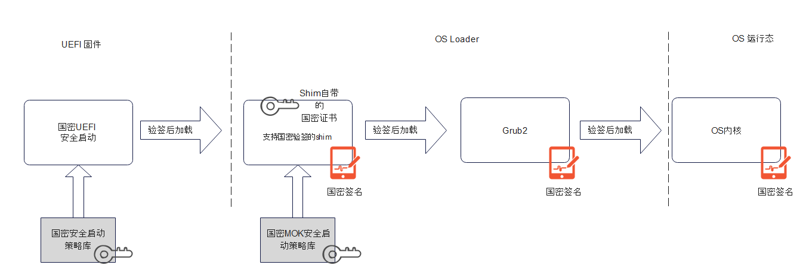
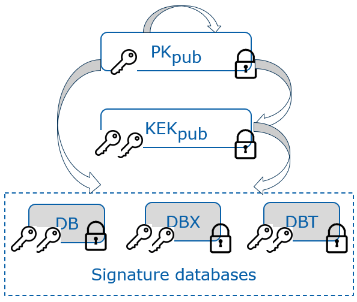
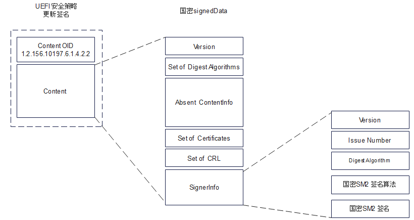

# 国密安全启动

## UEFI安全启动简介

系统安全始于系统初始状态。在系统安全设计中，固件或作为系统安全根，或作为安全链路中的重要初始环节， 负责初始安全配置并将安全状态延伸至运行态操作系统。一旦启动固件发生恶意软件侵入，如BootKit, 将会动摇整个系统安全。

为保证启动固件安全，UEFI标准中定义了安全启动标准 - UEFI Secure Boot。其核心设计思想是部署合理的PKI证书作为安全策略，在启动中对所有需要执行的第三方固件模块进行密码学校验。

其实现细节如下:

1. 使用公共CA服务提供签名证书，对UEFI可执行模块(包括设备驱动， 操作系统启动项，第三方工具等)进行数字签名。签名前需保证可执行模块符合安全标准。

2. 制定系统启动UEFI安全启动策略并部署。包括可执行白名单、黑名单、验证证书强制失效时间，签名时间戳证书列表等。

3. 系统启动中，强制使用UEFI安全启动策略对签名进行校验，通过则允许执行第三方固件模块，否则拒绝。

4. UEFI启动安全策略支持更新，且更新过程必须安全。在系统生命周期中，随着系统演进，环境变化，证书失效等需求变化，启动安全策略需要及时更新。更新需求可以来自平台的所有者，如执行新的硬件启动设备；也可能来自操作系统，如为了阻止某些带有安全缺陷的bootloader。新的安全策略同样带有签名，只有通过签名验证，且符合时效性，才能被目标系统接受。更新策略必须灵活，允许全部刷新，部分添加。

## UEFI安全启动存在的问题

UEFI 安全启动从设计上补齐了系统启动的安全短板，能够解决固件启动中扩展执行第三方模块、OS启动项时的安全隐患；同时支持灵活的安全策略配置；能够从源头构建完整的安全链路。自UEFI2.3.1 正式引入功能以来，UEFI安全启动已然成为各类系统的标准安全配置，广泛应用于个人电脑，笔记本，HPC，云服务器，网络存储和路由等各种应用场景。尽管UEFI安全启动具备很多优良的特性，作为国外科技企业主导定义的安全标准，它在标准定义、实现和实际部署中，仍然存在诸多不可忽视问题:

1. UEFI安全启动设计标准限定了密码学算法的选用，如Hash算法仅支持SHA-2 256, 384, 512 等，数字签名校验算法仅支持EMSA-PKCS1-v1_5 。

2. 仅支持RFC 标准PKCS7 Signed Data格式，不兼容国密算法定义的签名格式，。

3. PKI强依赖于外部营运的UEFI CA，无法自主控制第三方固件的恶意签发；无法自主控制国产操作系统升级迭代；固件安全漏洞响应时，无法及时生成更新的黑名单策略。

4. 未能强化国密验证策略，例如白名单中所有证书处于相同等级，未支持国密证书强制验证或优先验证。当国密证书和其他CA证书共存时，UEFI安全启动可能无法构建一条完整的，基于国密验证的安全链条。

## 支持国密的UEFI安全启动

### 国密 BootLoader 支持和OS启动安全传递

* shim：作为UEFI安全启动和Linux OS loader的桥梁，是系统控制权从固件转移至操作系统的关键环节。Shim一般自身携带有操作系统的专属证书。实际运行中，shim会注册MOK secure boot协议，用来替代UEFI secure boot签名认证。认证时使用自身携带的或MOK存储的证书来验证OS下一阶段启动模块。

* grub2：  Linux启动中，使用grub2管理内核加载和参数配置。为构建完整的安全验证链路， grub2 利用上述MOK secure boot协议来进一步验证Linux内核文件。

* 国密OS启动安全传递链路：

  

### 依赖与工具集（Dependencies）

根据上面的介绍，要部署完整的国密UEFI 安全启动，需要固件，操作系统，CA，三方硬件厂商和工具集的密切配合。
* 系统固件
  - UEFI 固件：符合edk2固件开发规范，遵循芯片和平台安全开发手册, 完成从上电（G3->S0, S5->S0, S3->S0）或系统重置( Reset) 到运行态OS的系统初始化过程。UEFI固件必须具备支持国密SM2算法签名, 验证的能力，包括:
    1. 基于国密的固件安全更新，恢复机制
    2. 基于国密的UEFI安全启动验证
    3. 基于国密的UEFI安全启动策略更新
  - 三方UEFI设备固件和工具:  同样遵循edk2固件开发规范，产生的可执行模块可携带多个不同证书签发的数字签名，且至少一个由国密CA证书签发。
* 操作系统 Bootloader
  - shim:  需能验签国密SM2算法标准中定义的类PKCS7#格式数字签名(signedData)。当前的shim版本已经支持
  - grub2： 需能验签国密S国密SM2算法标准中定义的类PKCS7#格式数字签名(signedData)。当前的grub2版本已经支持。需要注意的是，grub2属于OS范畴,对内核国密签名的校验也由OS提供。
* 支持国密的CA服务
  * 提供两组国密公共服务，1. CA证书签发，注销，，CRL管理；2. 国密签名 。国密CA服务不属于本白皮书讨论范畴。
* 工具集
  - sbsigntools：签名工具，允许平台使用使用该工具对bootloader和内核进行签名。目前版本 0.9.3。
  - mokutils：MOK secure boot密钥管理工具。mokutils的rpm在shim-signed中提供。
  - efitools：UEFI secure boot密钥管理工具。目前版本 1.9.2。

### 安全启动策略更新验证体系

### 国密签名与验证

- 可执行文件国密签名格式

  

- 安全启动策略更新国密签名格式

  - 更新 PK
  - 更新 KEK
  - 更新 DB ， DBX，DBT
  - 更新 MOK 与 MOKX

    

    注:  国密SM2签名规范没有强制要求Hash 算法，但实际应用中推荐使用SM3 Hash 算法。

{{#template ../template/footer.md}}
